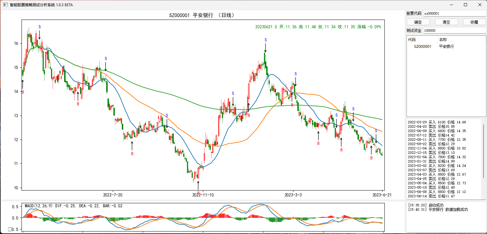
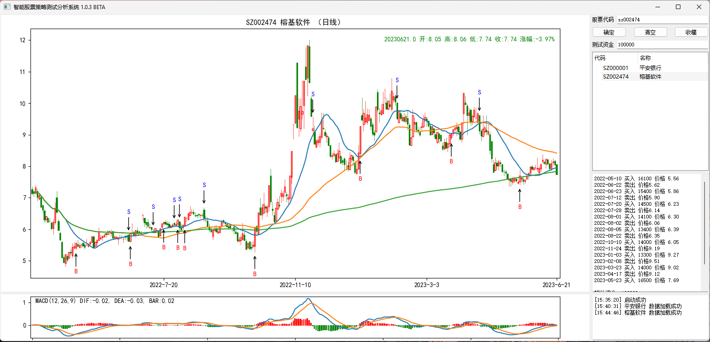

#### 联系QQ （用QQ扫二维码，或者添加QQ号）
####  - 📫 联系本人 ...

* 购买软件、收购项目，可联系本人邮箱或添加QQ

* Email: 26010455@qq.com

* QQ: 26010455（添加请注明来意 否则不予通过）

* 扫码加好友 QQ/微信（推荐QQ）

  

# AI_STOCK
大A股量化交易第一个模型测试，机器么得感情，亏钱不会吃面

前段时间开始着手做一个量化交易模型，然后到今天为止，第一款模型总算有点样子了。

写了一些交易策略后，将模型训练起来，总体还是赢利的，但是，虽然机器判断行情么得感情，避开了各种心理大坑，大A的风险仍然未能全部躲得过去。

用深市的前几支股票来看下模型回测的结果吧：

>写在前面：
>
>1、整体的策略采用右侧交易，这也符合本人稳的性格。以赚钱为目的，要亏钱的还是直接捐了的好。
>
>2、仓位策略目前没有，直接梭哈。
>
>3、买入在买入判定后收盘价梭哈，卖出在卖出指标后当日收盘价。因为买入时行情向上，收盘价偏高，卖出时行情基本向下，收盘价偏低。总体赢利会少一些。但个人觉得这样判断赢利是对策略的严格要求，有利于后期提高。
>
>4、这只是第一个版本。
>
>5、原则：只做策略测试，不做买卖建议。
>
>

1、SZ000001 平安银行

测试结果：

2022-03-29 买入 6100 价格 14.68

2022-04-20 卖出 价格15.85

2022-06-09 买入 6600 价格 14.35

2022-07-12 卖出 价格14.42

2022-08-11 买入 7700 价格 12.35

2022-09-22 卖出 价格12.29

2022-11-04 买入 8800 价格 10.82

2022-12-15 卖出 价格13.10

2023-01-04 买入 7800 价格 14.32

2023-01-31 卖出 价格14.99

2023-03-02 买入 8200 价格 14.24

2023-03-07 卖出 价格13.69

2023-04-03 买入 8800 价格 12.67

2023-04-25 卖出 价格12.28

2023-05-04 买入 8500 价格 12.73

2023-05-18 卖出 价格12.49

2023-06-08 买入 8800 价格 12.12

2023-06-14 卖出 价格11.47

初始资金：100000

当前账户资金：114910.12

赢利：14910.12

2、SZ002474 榕基软件

2022-05-10 买入 16100 价格 5.56

2022-06-22 卖出 价格5.62

2022-06-23 买入 15400 价格 5.86

2022-07-12 卖出 价格5.90

2022-07-20 买入 14500 价格 6.23

2022-07-28 卖出 价格6.14

2022-08-01 买入 14100 价格 6.30

2022-08-02 卖出 价格6.06

2022-08-05 买入 13400 价格 6.39

2022-08-22 卖出 价格6.35

2022-10-10 买入 14000 价格 6.05

2022-11-24 卖出 价格9.19

2023-01-03 买入 13300 价格 9.27

2023-02-08 卖出 价格9.51

2023-03-23 买入 14000 价格 9.02

2023-04-17 卖出 价格9.12

2023-05-23 买入 16500 价格 7.69

初始资金：100000

当前账户资金：141958.3

赢利：41958.30

